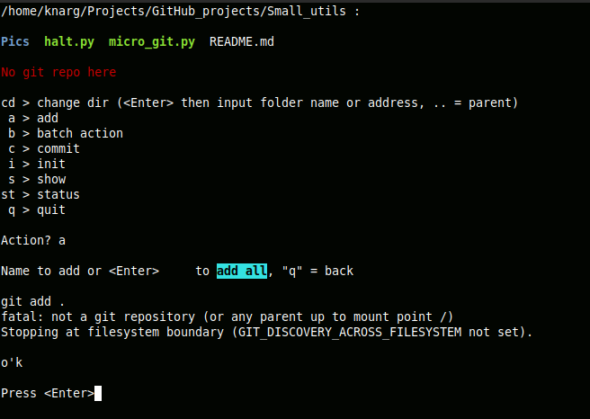
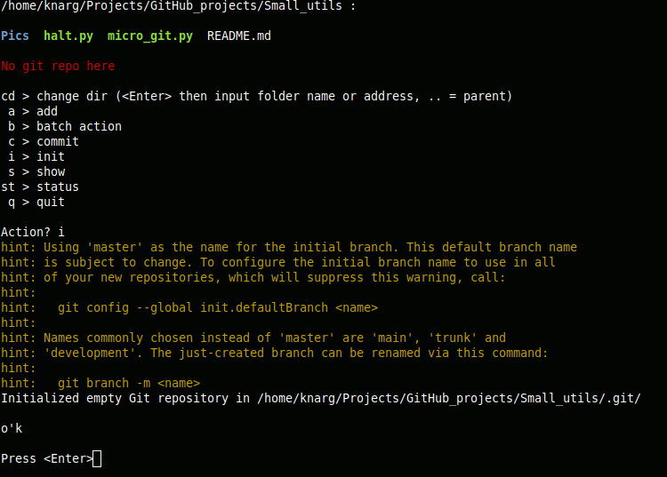
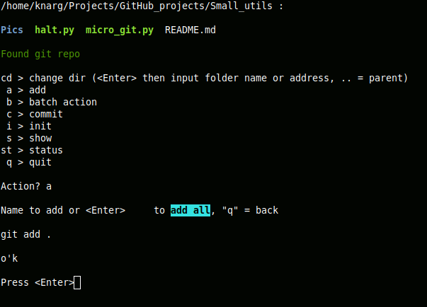
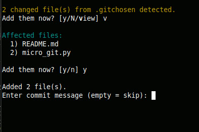
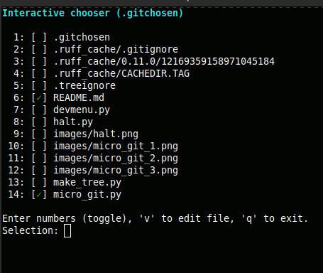
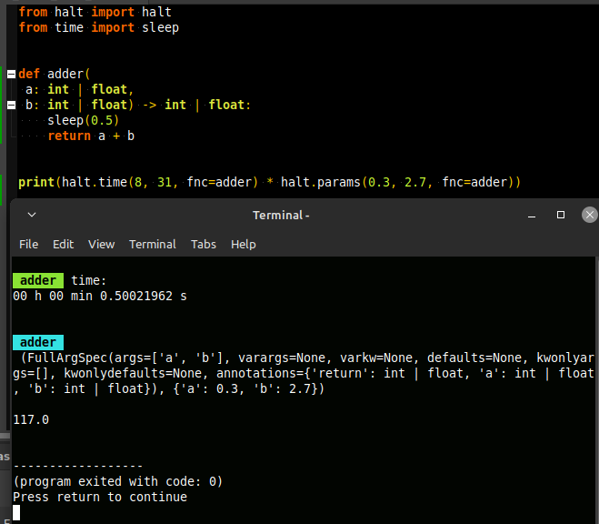

# One-file-utils
## Small applications for the daily needs of the developer.

### _Table of contains_:
- [_micro-git_](#micro-git)
- [_halt_](#halt)
- [_make-tree_](#make_tree)
- [_devmenu_](#devmenu)
---

# micro-git

**A minimalist CLI tool for fast and convenient Git operations**

`micro-git` is a small Python script that allows quick execution of basic Git commands (add, commit, batch add/commit, status, etc.) from the console with a simple text menu.
It’s perfect for local use in projects with frequent commits.






---

## Key Features

- Automatically detects the script’s own location and the current working directory
- Auto-detects .git folder in the current directory
- Add individual files or all at once
- Batch add and commit selected files
- View Git status and recent changes (git status, git show)
- Navigate directories from the menu
- Initialize a new Git repository
- **Manage custom file lists** via `.gitchosen` — create and edit a list of “favorite” files for batch operations and auto-stage commits

`.gitchosen` Feature

A simple but powerful extension that acts as the reverse of `.gitignore`:
instead of excluding files, it defines a set of files that you frequently work with.

- Manage your list interactively from the menu `(ch)`
- Quickly toggle selected files with color-highlighted updates
- The list is stored in `.gitchosen` (plain text) and reused in batch actions
- When you start the tool, it automatically detects modified files from .gitchosen and offers to:
  - view the list `(v)`
  - add & commit them immediately `(y)`
  - or skip the action `(n)`

This makes the workflow nearly automatic:
if any “favorite” file changes, `micro-git` will notice and offer to stage and commit it as soon as you launch the script.

**Unique feature:**
The script detects its own location intentionally so that this single small file can be moved or copied into any project folder and run right from there — no need to `cd` into the directory first, saving you time and effort.

---

## Installation

1. Download the `micro_git.py` file to a convenient location, for example, `~/bin/`
2. Make it executable:

```bash
chmod +x ~/bin/micro_git.py
```
3. Run it from the console:
```bash
~/bin/micro_git.py
```
You can also place this file directly inside your project folder and run it simply from the IDE. Keep in mind that some IDEs, such as Pycharm, have problems executing ANSI codes (colored text, positioning, etc) in their virtual terminal.

## Usage
After launching, the script will show a menu with available actions, for example:
Select an action by entering the corresponding letter and follow the prompts.

Example: Batch Add and Commit
- Choose b — batch action

- Choose ba — batch add & commit

The script will display a list of changed files with numbers

- Enter the numbers of the files you want to add, separated by spaces (e.g., 1 3 5), or press Enter to add all

- Enter the commit message

- Receive confirmation of a successful commit
---

# halt
## Timing and Argument Inspection Module

**`halt`** is a lightweight utility module for measuring the execution time of a function, either by using it as a **decorator** or by calling it **explicitly**. It also provides introspection on the parameters and arguments passed to the function.


---

## Features

- Measure execution time of any function.
- Inspect full parameter/argument mapping.
- Can be used as a decorator or a function call.
- Returns the result of the original function.
- Works as a **single-file utility**, ready to be dropped into any folder and used immediately without changing directories.

---

## ⚠️ Important Limitation

> **Do not use `halt` as both a decorator and a callable wrapper on the same function.**
> This will cause infinite recursion and crash with a `RecursionError`.

---
## Installation
> Place the file `halt.py` in the folder where your project files are found. Or, a more universal solution: place this file inside `/lib` or `/site-packages` inside your Python. Then simply import to your code.

---
## Usage

### 1. As a decorator (for measuring execution time only)

```python
from halt import halt
from time import sleep


@halt
def slow(n: int | float=0):
    sleep(n)
    print('Done\n')


slow(0.7)
```

### 2. As a callable wrapper

```python
from halt import halt
from time import sleep


def slow(n: int | float=0):
    sleep(n)
    print('Done\n')


halt.time(0.5, fnc=slow)
halt.params(0.33, fnc=slow)
```

### 3. More complicated use when wrapping in `halt` does not interfere with the implementation of the main logic of code

```python
from halt import halt
from time import sleep


def adder(
 a: int | float,
 b: int | float) -> int | float:
    sleep(0.5)
    return a + b


print(halt.time(8, 31, fnc=adder) * halt.params(0.3, 2.7, fnc=adder))
```

```python
from halt import halt
from time import sleep


@halt
def adder(
 a: int | float,
 b: int | float) -> int | float:
    sleep(0.5)
    return a + b


print(adder(13, 22) / adder(0.3, 3.3))
```
---
# make_tree

## Directory Tree Generator & Comparator

`make_tree.py` is a small command-line tool and interactive script that generates a visual tree of any folder structure. It can save the result to a text file and compare it with other saved snapshots or the current state of the filesystem.

**_New feature:_** ignore specified files and folders by name, via a list entered manually or loaded/saved from a .treeignore file in the root directory.

---

## Features

- Generates a clean directory tree with files and subfolders
- Supports both command-line and interactive modes
- Supports ignoring specified files and directories by name
- Loads and saves ignore lists in a .treeignore file
- Optionally includes hidden files and folders
- Saves output to a file (default: `tree.txt`) or skips saving entirely
- Compares current tree with a saved file or compares two saved trees
- Highlights changes in comparison (green = added, blue = removed)

---

## Usage

```bash
python3 make_tree.py [options] [folder]

```
---
**Ignore List (.treeignore)**
- If a .treeignore file exists in the root folder, the script prompts to use its exclusions, ignore the file, or create a new ignore list.

- You can enter space-separated names of files and directories to ignore.

- When saved to .treeignore, the file itself is automatically added to the ignore list to avoid including it in the tree.

- Ignored entries are excluded from the output and tree traversal.

# devmenu

`DevMenu` is a lightweight, universal CLI interactive menu system for running functions with arguments.
Ideal for developer utilities, test consoles, and interactive tools.

---

## Features

- Create menu from a dictionary like:

```python
{
    "1": ("Item description", function, args, kwargs),
    "2": ("Another item", another_function, (), {})
}
```

- Calls functions with arguments when selected.

- Temporarily hides the menu while the function runs.

- Returns to the menu after function completion or exception.

- Logs the last messages directly in the menu (console output).

## Usage

```python
from devmenu import DevMenu

def greet(name: str):
    print(f"Hello, {name}!")

def add(a, b):
    print(f"{a} + {b} = {a + b}")

actions = {
    "1": ("Say Hello", greet, ("Alice",), {}),
    "2": ("Add numbers", add, (3, 5), {}),
}

menu = DevMenu(actions, title="My Dev Menu")
menu.run()
```

- Selecting a menu item runs the function.

- Exceptions are caught and printed without breaking the menu.

- Quit the menu by pressing q.

## API

| Method                                                 | Description                                                                                     |
| ------------------------------------------------------ | ----------------------------------------------------------------------------------------------- |
| `__init__(actions, title="Dev Menu", message_lines=5)` | Initializes the menu. `actions` is a dict mapping keys to (description, function, args, kwargs) |
| `run()`                                                | Runs the menu main loop                                                                         |
| `show_menu()`                                          | Displays the current menu and last messages                                                     |
| `run_action(fnc, args=(), kwargs={})`                  | Runs the function in "full screen" mode                                                         |
| `log(msg)`                                             | Adds a message to the log and displays it at the bottom of the menu                             |

## Example Output

```
=== My Dev Menu ===
1) Say Hello
2) Add numbers
q) Quit

--- Messages ---
No messages yet
```
